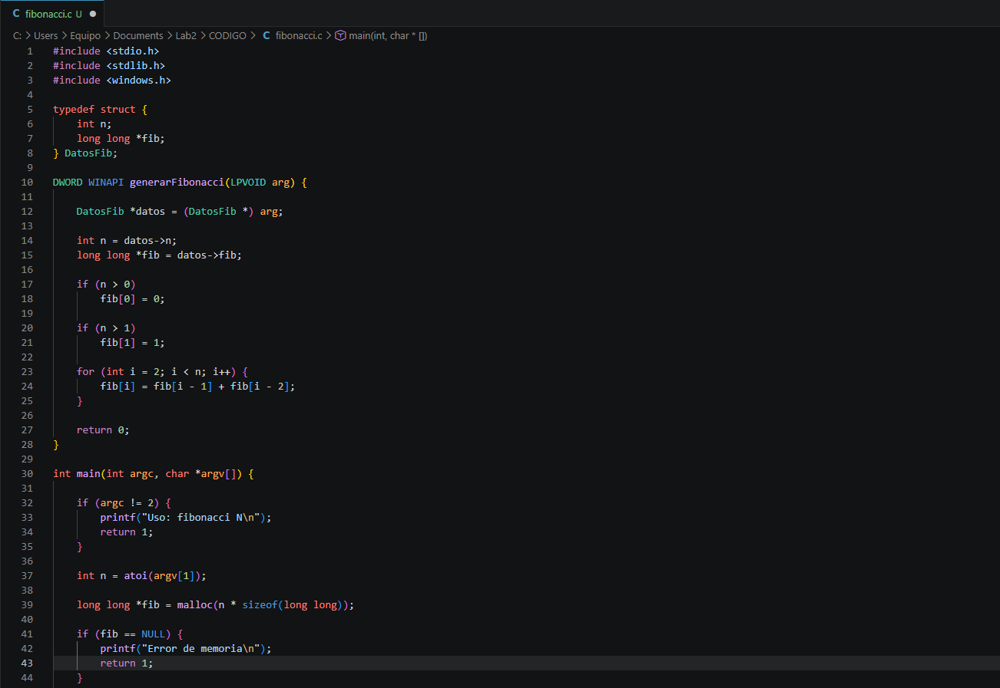
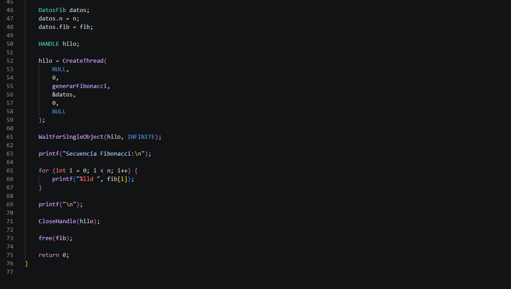
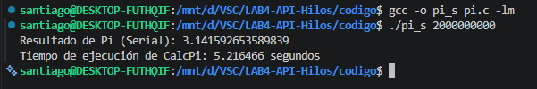
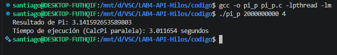
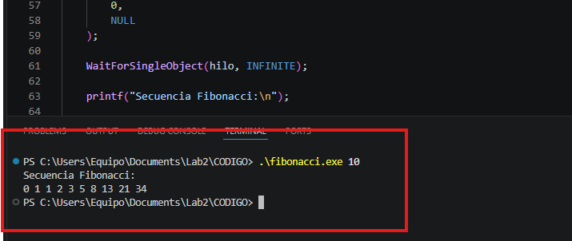

# LAB4-API-HILOS

## (a) Nombres completos de los integrantes, correos y números de documento.

### Santiago Jiménez Escobar - santiago.jimeneze@udea.edu.co - C.C 1036959331
### Emiro Moreno Soto - emiro.morenos@udea.edu.co - C.C 1001547311

## (b) Documentación de todas las funciones desarrolladas en el código.

## 1. Paralelización del Cálculo de π

# Programa Serial

La función `GetTime()` en la versión serial cumple exactamente el mismo propósito que en la versión paralela. Su objetivo es proporcionar una medición precisa del tiempo de ejecución del núcleo computacional encargado de aproximar el valor de π. Gracias a esta función es posible obtener métricas de rendimiento que posteriormente se utilizarán para calcular el speedup y la eficiencia de la implementación paralela.

La función `CalcPi()` implementa el algoritmo secuencial utilizado para aproximar el valor del número π mediante integración numérica. El método empleado consiste en dividir el intervalo de integración en `n` rectángulos de igual tamaño y aproximar el área bajo la curva utilizando el punto medio de cada subintervalo.

Durante cada iteración del ciclo principal se calcula la coordenada correspondiente al punto medio del rectángulo actual y se evalúa la función matemática `f(x)=4/(1+x²)`. El resultado obtenido se acumula en la variable `fSum`, que representa la suma de las áreas parciales. Una vez finalizado el recorrido de todos los rectángulos, la suma acumulada se multiplica por el ancho de cada subintervalo para obtener una aproximación del valor de π. Debido a que toda la computación se realiza en un único hilo de ejecución, esta función sirve como referencia para comparar el desempeño de la versión paralela.

La función `main()` de la versión serial controla la ejecución completa del programa. En primer lugar, verifica que el usuario haya suministrado correctamente el número de rectángulos mediante argumentos de línea de comandos. Posteriormente convierte dicho valor a un entero y valida que sea mayor que cero.

Una vez realizada la validación, se inicia la medición de tiempo utilizando la función `GetTime()`. A continuación, se invoca la función `CalcPi()`, que realiza todo el cálculo de forma secuencial. Cuando la ejecución finaliza, se obtiene nuevamente el tiempo actual y se calcula la diferencia entre ambos valores para determinar el tiempo total consumido por el algoritmo.

Finalmente, la función `main()` imprime en pantalla la aproximación obtenida para π y el tiempo de ejecución medido, proporcionando así los datos necesarios para realizar posteriormente el análisis de rendimiento y la comparación con la implementación paralela.

# Programa Paralelo

La estructura `ThreadData` se utiliza como mecanismo de comunicación entre el hilo principal y los hilos trabajadores. Cada instancia de esta estructura almacena la información necesaria para que un hilo pueda identificar qué porción del trabajo le corresponde ejecutar. Además, permite guardar el resultado parcial calculado por cada hilo en la variable `partial_sum`, la cual posteriormente es utilizada por el hilo principal durante la fase de reducción para obtener el resultado global. Gracias a esta estructura se evita el uso de variables globales y se facilita el intercambio seguro de datos entre los diferentes hilos.

La función `CalcPiThread()` corresponde al núcleo computacional de la versión paralela del programa y es ejecutada de manera concurrente por cada uno de los hilos creados. Su objetivo es calcular una parte de la aproximación numérica de π utilizando el método de integración por rectángulos. Para ello, recibe como parámetro un puntero a una estructura `ThreadData`, desde donde obtiene el identificador del hilo, el número total de rectángulos y la cantidad total de hilos participantes.

A partir de estos datos, la función `CalcPiThread()` determina el rango de iteraciones que debe procesar cada hilo mediante una estrategia de partición estática. Cada hilo calcula únicamente la fracción de trabajo que le corresponde, evaluando la función matemática `f(x)=4/(1+x²)` en los puntos medios de los rectángulos asignados. El resultado parcial se almacena en una variable local denominada `local_sum`, evitando así accesos concurrentes a memoria compartida y reduciendo significativamente la contención entre hilos. Finalmente, el resultado calculado se almacena en el campo `partial_sum` de la estructura compartida y el hilo finaliza su ejecución mediante `pthread_exit()`.

La función `GetTime()` es una función auxiliar encargada de medir tiempos de ejecución. Su implementación utiliza la llamada al sistema `gettimeofday()`, la cual proporciona el tiempo actual con precisión de microsegundos. Posteriormente, los valores correspondientes a segundos y microsegundos son convertidos a un único valor de tipo `double` expresado en segundos. Esta función es utilizada para instrumentar el código y calcular el tiempo requerido para ejecutar la aproximación de π, permitiendo posteriormente analizar el rendimiento de la implementación paralela y compararlo con la versión secuencial.

La función `main()` constituye el punto de entrada del programa paralelo y coordina todo el proceso de ejecución. Inicialmente valida que el usuario haya proporcionado correctamente el número de rectángulos y la cantidad de hilos mediante argumentos de línea de comandos. Una vez verificados los parámetros, reserva dinámicamente la memoria necesaria para almacenar los identificadores de los hilos y las estructuras `ThreadData` asociadas a cada uno de ellos.

Posteriormente, la función `main()` inicia la medición de tiempo y procede a crear los hilos utilizando la función `pthread_create()`. Cada hilo recibe una estructura con la información necesaria para ejecutar su parte del cálculo. Después de la creación, el hilo principal espera la finalización de todos los trabajadores mediante llamadas a `pthread_join()`. Durante esta fase también realiza la reducción de resultados, sumando los valores parciales calculados por cada hilo.

Una vez obtenida la suma total, la función `main()` multiplica el resultado por el ancho de los rectángulos para calcular la aproximación final de π. Finalmente, registra el tiempo de finalización, muestra en pantalla el valor obtenido y el tiempo de ejecución total, y libera la memoria reservada dinámicamente antes de terminar el programa.

## 2. Generador de Secuencia de Fibonacci
El programa utiliza un hilo trabajador para calcular la secuencia de Fibonacci y almacenarla en un arreglo compartido reservado dinámicamente por el hilo principal.

La comunicación entre el hilo principal y el hilo trabajador se realiza mediante una estructura **(`DatosFib`)** que contiene el valor de **`N`** y un puntero al arreglo compartido.

El hilo principal utiliza **`pthread_join()`** para sincronizar la ejecución y garantizar que la secuencia haya sido calculada completamente antes de imprimir los resultados.

El uso de memoria compartida evita copias innecesarias de datos y permite que el hilo trabajador escriba directamente en el arreglo que posteriormente será leído por el hilo principal.

## (c) Problemas presentados durante el desarrollo de la practica y sus soluciones.
Uno de los problemas presentados fue durante el desarrollo del notebook de Jupyter. Inicialmente, se intentó realizar la codificación de este código allí, pero nos encontramos con la limitante de que el kernel de este notebook no era compatible como máquina virtual de linux, por lo que no era compatible la ejecución de nuestro código. Sin embargo, en esta herramienta se pudo realizar la documentación de resultados de manera adecuada también fue posible la generación de gráficas, gracias a la utilización de python el cual sí está integrado en el notebook 

## (d) Pruebas realizadas a los programas que verificaron su funcionalidad.

En la siguiente imagen se observa la ejecución del programa Pi en su version serial

En la siguiente imagen se observa la ejecución del programa Pi en su version paralela

En la siguiente imagen se observa la ejecución del programa fibonacci y como se genera su secuencia

## (e) Un enlace a un video de 10 minutos donde se sustente el desarrollo.

[Haz clic aquí para ver el video](https://youtu.be/CgZYEnMxKqE)

## (f) Manifiesto de transparencia: En que puntos se apoyaron de la IA generativa.
Se utilizó para comprender algunos comandos para la generación de gráficas en python y para entender la diferencia que había en el resultado de pi en ciertos decimales, ya que, al parecer, cuando un proceso se divide en diferentes hilos y después se vuelve a unir el resultado, es posible que se presenten estas variaciones decimales.
## (g) Al menos cinco conclusiones.

1. Fue posible generar correctamente la secuencia de Fibonacci utilizando un hilo trabajador.

2. La transferencia de información entre hilos se realizó mediante una estructura compartida.

3. El uso de WaitForSingleObject permitió sincronizar correctamente la ejecución.

4. La memoria dinámica permitió almacenar una cantidad variable de elementos de la secuencia.

5. El ejercicio permitió comprender los conceptos básicos de concurrencia y sincronización mediante hilos.

## (h) Notebook de analisis.

[📓 Ver análisis](https://github.com/santije23/LAB4-API-Hilos/blob/main/analisis.ipynb)